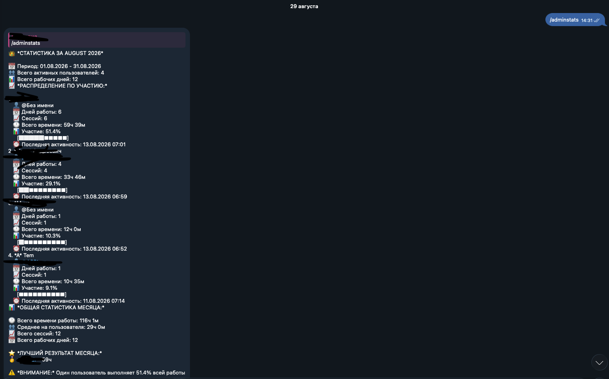
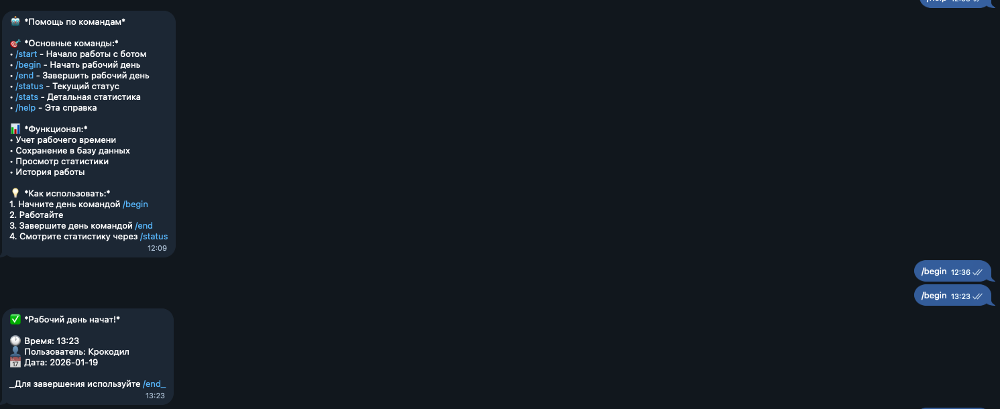

```markdown
# Time Tracker Bot — Telegram-бот на Swift (Vapor)


**[🇬🇧 English](README.md)** | **🇷🇺 Русская версия**

Пет-проект: Telegram-бот для учёта рабочего времени сотрудников. Развёрнут на выделенном Ubuntu Server. Демонстрирует enterprise-практики (Сбер), адаптированные под solo-разработку.

---

## Демо

### Статистика за месяц


*Бот показывает статистику за месяц: распределение по пользователям, участие в процентах, прогресс-бары, общий итог.*

### Справка и начало рабочего дня


*Бот выдаёт справку по командам и подтверждает начало рабочего дня.*

---

## Что делает бот

- **Учёт рабочего времени:** старт/стоп сессии, паузы, автоматическое завершение через 12 часов.
- **Привязка к проектам:** выбор проекта при старте дня, статистика по каждому проекту.
- **Статистика:** детальные отчёты за день, месяц, по пользователям и проектам.
- **Управление проектами:** создание, удаление, просмотр сессий (только для администраторов).
- **Напоминания:** автоматическое напоминание через 8 часов после начала работы.
- **Команда `/ping`:** проверка работоспособности бота.

---

## Инфраструктура и DevOps-практики

| Практика | Реализация |
|---|---|
| Управление сервисом | **systemd** (автозапуск, рестарт при падении) |
| База данных | **PostgreSQL** (Fluent ORM) |
| Логирование | **journald** |
| Алертинг | критические ошибки → **Telegram-чат** |
| Разделение окружений | **production / development** через переключение конфига |
| Деплой | `git pull` → `swift build -c release` → `systemctl restart` |
| Удалённый доступ | **SSH** (ключи + fail2ban) |

---

## Инженерные решения

- **Разделение окружений под масштаб проекта.** В Сбере использовалось 5 окружений под разные роли (dev, QA, security, приёмка, prod). Для solo-проекта я сократил их до двух (production / development) — этого достаточно, чтобы тестировать на клоне бота, не останавливая основной сервис.
- **Алертинг вместо полноценного мониторинга.** Вместо развёртывания Prometheus + Grafana я настроил отправку критических ошибок напрямую в Telegram — минимальные накладные расходы при сохранении контроля 24/7.
- **Разделение кода и конфигурации.** Токены и параметры БД вынесены в переменные окружения (`DATABASE_PASSWORD`, `BOT_TOKEN`). Переключение окружения — без изменения кода.
- **Безопасность по умолчанию.** SSH с ключами, fail2ban, вынесенные токены, `.gitignore` для личных данных — стандартные практики, перенесённые из enterprise.

---

## Стек

- **Язык:** Swift, Vapor
- **База данных:** PostgreSQL (Fluent ORM)
- **Инфраструктура:** Ubuntu Server, systemd, journald
- **Контроль версий:** Git, GitHub
- **Мониторинг:** алертинг в Telegram

---

## Схема деплоя

1. Разработка в отдельной ветке от `main`.
2. Push в GitHub.
3. На сервере: `git pull` → `swift build -c release` → `systemctl restart`.
4. Критические ошибки автоматически приходят в Telegram.

---

## Пример systemd-юнита

Бот управляется через systemd (автозапуск, рестарт при падении).

Полный пример: [docs/systemd.service](docs/systemd.service)

```ini
[Unit]
Description=time-tracker-bot service
After=network.target
StartLimitIntervalSec=0

[Service]
Type=simple
User=waifubot
Restart=always
RestartSec=10
WorkingDirectory=/opt/time-tracker-bot
EnvironmentFile=-/etc/time-tracker-bot/env
ExecStart=/opt/time-tracker-bot/.build/release/App

[Install]
WantedBy=multi-user.target
